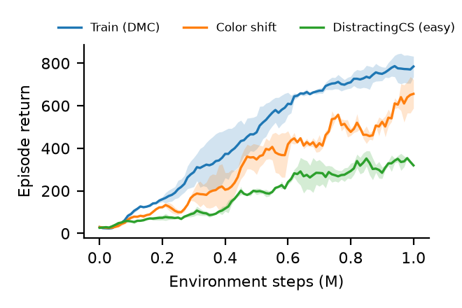

# ALDA on SAC: zero-shot generalization without data augmentation

Reimplementation of ALDA ([Batra & Sukhatme, ICML 2025](https://arxiv.org/abs/2410.07441)) on top of CleanRL-style SAC. The agent learns from pixels on DeepMind Control and is evaluated zero-shot on visual distribution shifts from the Distracting Control Suite. No augmentation is used.

**Report:** [`report/report.pdf`](report/report.pdf) (English, ICML format) · [`report/report_ru.pdf`](report/report_ru.pdf) (Russian)

## Results

walker-walk, 1M environment steps, 2 seeds. Evaluation return averaged over the last 100k steps (11 evaluations × 5 episodes):

| Environment | Seed 1 | Seed 2 | Mean | Fraction of train |
|---|---|---|---|---|
| Train (DMC) | 722 | 833 | 778 | 1.00 |
| Color shift | 589 | 668 | 628 | 0.81 |
| Distracting CS (easy) | 329 | 339 | 334 | 0.43 |



The report also covers reconstructions of OOD frames, latent traversals, latent statistics over training, and the research question: does the associative latent model act more on OOD inputs, and does the size of its correction explain the performance drop? Short answer: it acts about 1.8× more on OOD frames, but the size of the correction does not predict the return gap.

## Setup

Python 3.12 and [uv](https://docs.astral.sh/uv/):

```bash
uv sync
```

Evaluation on the Distracting Control Suite needs the DAVIS 2017 videos (~800 MB) in `data/DAVIS/JPEGImages/480p`:

```bash
mkdir -p data
wget -O data/davis.zip https://data.vision.ee.ethz.ch/csergi/share/davis/DAVIS-2017-trainval-480p.zip
unzip -q data/davis.zip -d data && rm data/davis.zip
```

Rendering is headless through EGL (`MUJOCO_GL=egl`, set by `alda.py` if unset).

## Training

Hyperparameters live in YAML configs; any key can be overridden as `key=value` (dotted for nested keys):

```bash
uv run python alda.py configs/walker_walk.yaml
uv run python alda.py configs/walker_walk.yaml seed=2 agent.beta=10
```

Configs exist for `walker_walk`, `cartpole_balance`, `ball_in_cup_catch` and `finger_spin`; only walker-walk was trained to 1M steps for the report. One 1M-step run takes about 9 hours on an RTX 3090 and needs ~6–12 GB RAM for the replay buffer.

Quick smoke test:

```bash
uv run python alda.py configs/walker_walk.yaml total_env_steps=5000 eval_every=2500 eval_episodes=1
```

Each run writes to `runs/<env>_s<seed>_<timestamp>/`:

- `train.csv`, `eval.csv`: per-episode training stats, and per-evaluation return and latent statistics for each eval environment
- TensorBoard events (the same scalars, plus reconstructions and latent traversals at every evaluation)
- `recon_*.png`, `traversal.png`: latest reconstructions and latent traversals
- `agent.pt`: latest weights; `checkpoint.pt` + `buffer.npz`: full state for resuming

Resume or extend a run:

```bash
uv run python alda.py runs/<run>/config.yaml resume=runs/<run> total_env_steps=2000000
```

## Figures

The report figures are built from the run logs in `runs/main1m/`:

```bash
uv run --with pandas --with matplotlib python report/plots.py        # returns, latent stats
uv run --with pandas --with matplotlib python report/plots_extra.py  # training dynamics, retention, RQ scatter, evolution from TensorBoard
```

Add `ru` as an argument to get the same figures with Russian labels (`*_ru.pdf`). Build the reports with `latexmk -pdf report.tex` / `latexmk -pdf report_ru.tex` inside `report/`.

## Layout

```
alda.py               # everything: env wrapper, replay buffer, networks, ALDA agent, training/eval loop
configs/              # per-task YAML configs
distracting_control/  # Distracting Control Suite (vendored from google-research)
report/               # ICML-style report (EN/RU), figures, plotting scripts
```

## Implementation notes

The report (Sec. 3) covers the details and the deviations from the paper. In short:

- Encoder/decoder follow QLAE's appendix with GELU. The latent model is 12×12 scalar codebooks with softmax(−β·L1) retrieval (β = 100). Each frame of the 3-frame stack is encoded separately and combined by a 1D CNN.
- The critic loss trains the codebook and the history encoder but not the encoder. The encoder gets gradients only from reconstruction and commitment. There is no quantization loss.
- Weight decay 0.1 on the encoder/decoder uses AdamW. With coupled L2 in Adam, the encoder collapsed to a constant.
- The color-shift eval env is the DCS color wrapper (`max_delta=0.5`), used as a stand-in for DMCGB "color hard".
